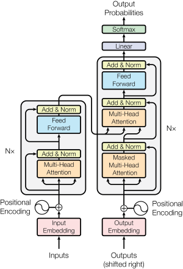
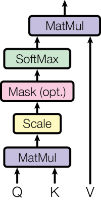
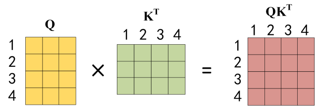
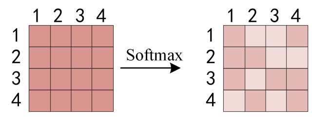
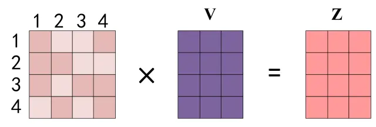

# Transformer 源码解析
## 前言 
今天心血来潮，我认为从22年开始到如今的AI大爆发全是因为一篇来自2017年的一篇解决翻译问题的论文[Attention is all you need](https://arxiv.org/abs/1706.03762)导致的，而在此之前我了解的都是CNN方面的工作所以我想我也是时候了解一下这篇跨时代的论文（不然真的就out了）。在本文中我们结合Attention is all you need这篇论文来解读来自于pytorch官方仓库的Transformer源码实现：torch.nn.Transformer。

## 3 Model Architecture
是不是有人好奇为啥直接跳到第三章了，因为论文前两章主要介绍了论文的摘要以及引言，我们今天的重点是其中的技术实现，所以我们暂且跳过前两章~~~🐹🐭🐹🐭


### 3.1 架构介绍
在Transformer中它分为两个部分：编码器、解码器，如上图，左边的为编码器，右边的部分为解码器，在编码器解码器的架构中编码器可以将文本信息转换为feature，然后在解码器中慢慢从feature中生成我们需要翻译对应的文本。在这里我们先介绍编码器，了解了编码器的结构我们可以很方便的拓展到解码器。

在进行网络的输入之前需要对文本进行处理：在开始，一串文本是不能直接输入进入模型的，我们需要将其编码为token，编码的方式有很多种，例如可以采用 Word2Vec、Glove 等算法预训练得到。

在得到token之后需要和Positional Enconding使token得到位置信息，并且在这里我们需要知道在翻译任务中文本的词与词之间的顺序是非常重要的，它携带了大量的信息，例如：蜜蜂和蜂蜜是完全两个不同的概念。在Transform中就是用了Positional Enconding来存储了输入文本的绝对或者相对的位置信息，然而以上这部分由于没有涉及到反向传播，所以这部分代码在pytorch实现中貌似并不包含，应该需要用户自己去写。
### 3.2 编码器
在得到位置编码（Positional Enconding）信息之后就可以将其输入进入Transformer 的编码器了，进入编码器的第一个部分就是多头注意力机制，而在多头注意力机制其实就是由多个Self-Attention结合而来，所以我们先从Self-Attention开始讲解。
#### Self-Attention


将上面那副图转换为公式就是这样：


\begin{equation}
    Attention(Q,K,V) = softmax(\frac{QK^{T}}{\sqrt{d_{k}}})V
\end{equation}
\begin{equation}
    {d_{k}}是Q，K矩阵的列数，即向量纬度。
\end{equation}


这里解释一下公式中和图片相对应的地方，首先公式的输入为QKV。图中的第一个块MatMul对应着公式中的$QK^{T}$。途中的第二个块Scale对应着公式中的$\sqrt{d_{k}}$这里的目的是为了防止$QK^{T}$的内积过大。其次就是Mask(opt.)块，这个块是可选块，如果这个Attention是作为模型的编码器的话那么就没有的。所以这个部分在公式中并没有描述出来。最后就是将以上说到的部分送进softmax中转换为伯努利分布最后与V矩阵进行一个点积。

接下来就是QKV的解释：我们可以看到一开始输入了Q(query)、K(key)和V(value),这三个值是怎么来的呢，这是在这之前的输入X会经过三个权重矩阵分别是WQ、WK、WV,在pytorch中的源码如下：
```python
#nn.modules.activation.MultiheadAttention
class MultiheadAttention(Module):
    def __init__(...) -> None:
        ...
        self.q_proj_weight = Parameter(torch.empty((embed_dim, embed_dim),...))
        self.k_proj_weight = Parameter(torch.empty((embed_dim, self.kdim),...))
        self.v_proj_weight = Parameter(torch.empty((embed_dim, self.vdim),...))
        ...
    
    def forward(self,query: Tensor,key: Tensor,value: Tensor,...):
        ...
        attn_output, attn_output_weights = multi_head_attention_forward(
            q_proj_weight=self.q_proj_weight, 
            k_proj_weight=self.k_proj_weight,
            v_proj_weight=self.v_proj_weight,
        )
        ...

def multi_head_attention_forward(...) -> Tuple[Tensor, Optional[Tensor]]:
    ...
    q, k, v = _in_projection(query, key, value, q_proj_weight, k_proj_weight, v_proj_weight, b_q, b_k, b_v)
    ...

def _in_projection(...) -> Tuple[Tensor, Tensor, Tensor]:
    return linear(q, w_q, b_q), linear(k, w_k, b_k), linear(v, w_v, b_v)
```
在这里我说一下我个人就自注意力机制中的QKV三个矩阵为什么能和查询，键，值这三个名词扯上联系的理解，我认为了解好这三个矩阵就可以在一定程度上了解transformer模型了。

说实话我刚开始听见这个QKV的时候第一时间联想到了mysql或者python里面的字典🤣，但我认为这其中也确实是有点联系的，在这里我们借用一下[知乎上](https://zhuanlan.zhihu.com/p/338817680)的图片以便大家方便的了解QKV矩阵：




在上图中$Q$的每一行和$K$的每一列其实都代表着输入每个单词，这里假设我们输入的是"I have a apple"，$Q$和$K^T$相成就可以得到一个4*4的一个矩阵在这里其实就可以看出来何为self-attention，在注意力机制中模型可以知道某个单词自己相对于其他单词之间的权重，也就是注意力值，在这个句子中的I一个和apple是有很强的联系的，所以就可以从$QK^T_14$中得到I相较于Apple的注意力值，这仿佛就对应了mysql中的一个表，可以根据查询语句Q和表K查询到相应的注意力权重。然后根据这个注意力的权重去和$V$进行一个相乘得到一个Value也就是。

根据上面的说法这里举个翻译任务的例子：
```python
Q = I have a apple
K = Mat#key矩阵
V = 我有一个苹果
```
根据Q和K的查询可以得到我们想要的翻译结果。

在这里我们也把所对应的pytorch官方实现给对一下：
```python
def multi_head_attention_forward(...) -> Tuple[Tensor, Optional[Tensor]]:
    ...
    q, k, v = _in_projection(query, key, value, q_proj_weight, k_proj_weight, v_proj_weight, b_q, b_k, b_v)
    ...
    B, Nt, E = q.shape
    q_scaled = q / math.sqrt(E)

    attn_output_weights = torch.bmm(q_scaled, k.transpose(-2, -1))
    attn_output_weights = softmax(attn_output_weights, dim=-1)
    attn_output = torch.bmm(attn_output_weights, v)
    
```
在上面的代码中`torch.bmm`代表了矩阵相乘，`k.transpose(-2, -1)`其实就是$K^T$

可以看出在上面的官方代码中稍微和本文给出的代码有些区别，但其实都是等价的


\begin{equation}
    softmax(\frac{Q}{\sqrt{d_{k}}}K^T)V=softmax(\frac{QK^{T}}{\sqrt{d_{k}}})V
\end{equation}


以上就是我对QKV的浅显理解，如果有误，还请指正。

> 剩下后续的部分我觉得可以分为几个篇章来讲，这部分就先到这里。后续随缘更新。