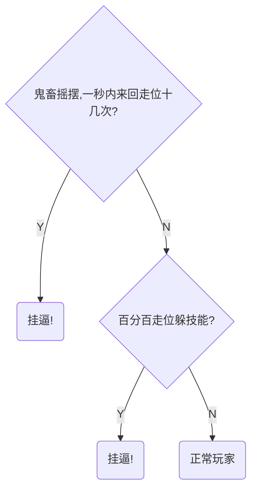

假设有以下情形，有一天你在打英雄联盟，你打的是辅助泽拉斯，你对线的是大嘴，你发现你的qwer无论如何都打不中对面的大嘴，直到最后游戏结束，你输的一败涂地，然后你决定用编程的力量应用到游戏里面，所以你设计了一个程序  </br>
这个程序可以用来判断你对线的召唤师是否开了挂，你的程序从一下两个方面去分析对方 走位的时候有没有鬼畜摇摆（也就是外挂程序和召唤师的操作有冲突，外挂程序向往左边走位但是召唤师却想往右边走位，导致一秒内来回走位十几次） 是不是百分百躲技能,如下图

上图就是一个决策树，但实际游戏中的脚本可并不是通过两个简简单单的判断就可以看出来对方是否是脚本的，现在的脚本不只有以上的几个特点，还包括但不限于，给锤石的灯笼自动插眼，全图透视，水银秒解控制，亚索无CD吹风等等……所以人为的设置判断条件并不现实，我们本文要做的事就是通过ID3算法智能的通过现有的数据集去自动生成这棵树，而并非人为的选择分支条件（鬼畜摇摆，百分百躲技能）以及结束条件（正常玩家，挂逼）。  </br>
## ID3 算法构建决策树的流程
(1) 收集数据：可以使用任何方法。  
(2) 准备数据：树构造算法只适用于标称型数据，因此数值型数据必须离散化。  
(3) 分析数据：可以使用任何方法，构造树完成之后，我们应该检查图形是否符合预期。  
(4) 训练算法：构造树的数据结构。  
(5) 测试算法：使用经验树计算错误率。  
(6) 使用算法：此步骤可以适用于任何监督学习算法，而使用决策树可以更好地理解数据
的内在含义。  
## 信息熵
信息熵（information entropy）是信息论的基本概念。描述信息源各可能事件发生的不确定性。20世纪40年代，香农（C.E.Shannon）借鉴了热力学的概念，把信息中排除了冗余后的平均信息量称为“信息熵”，并给出了计算信息熵的数学表达式。信息熵的提出解决了对信息的量化度量问题。————百度百科  </br>
简单来说熵就是用来计算信息的混乱程度，比如有一个数组  
```python
[小明,小明,小明,小明,小明]
``` 
这个数组里面就只有小明这一个元素那么这个数组它的熵就为0,代表这个数组很“纯净”  
再拿另外一个数组举例
```python
[小明,小明,小明,小红,小红]
```
上面这个数组中有小红小明这两种元素那么根据熵的计算公式  
得出来的结果为0.9709505944546686</br>  
如果是下面这个数组那么这个值将更加大
```python
[小紫,小白,小明,小黑,小红]
#2.321928094887362
```
但是我们要这个值来具体做什么呢，这个值在决策树中可以起到如何划分分支的作用 </br> </br> 
未  
完  
待  
续……
## code
```python
from collections import defaultdict
import copy
from math import log

def createDataSet():
    dataset = [
        [1,1,'y'],
        [1,1,'y'],
        [1,0,'n'],
        [0,1,'n'],
        [0,1,'n'],
    ]
    label = ['鬼畜摇摆,一秒内来回走位十几次?','百分百走位躲技能?']
    return dataset,label

dataset,label = createDataSet()

def calcShannonEnt(dataset):
    '''
    计算数据的熵
    这里计算的是最后一列的熵 也就是label那一列
    '''
    l = len(dataset)
    d = defaultdict(int)
    for i in dataset:
        d[i[-1]]+=1
    sn = 0
    for i in d.values():
        prop = i/l
        sn-=prop*log(prop,2)
    return sn

def splitDataSet(dataSet,axis,value):
    '''
    划分数据集
    '''
    dtst = copy.deepcopy(dataSet)
    retDataSet=[]
    for i in dtst:
        if i[axis]==value:
            i.pop(axis)
            retDataSet.append(i)
    return retDataSet

def chooseBestFeatureToSplit(dataSet):
    '''
    找出最好的划分方式
    '''
    numFeatures = len(dataSet[0])-1 #获取数据集的长度
    baseEntropy = calcShannonEnt(dataSet)  #计算该书籍的熵 也就是数据的纯度
    bestInfoGain = 0.0;bestFeature = -1
    ## 比较每个特征划分方式的香农熵
    for i in range(numFeatures):
        featList = [example[i] for example in dataSet]
        uniqueVals = set(featList)
        newEntropy = 0.0
        for value in uniqueVals:
#########################################################
            subDataSet = splitDataSet(dataSet,i,value)
            prob = len(subDataSet) / len(dataset)
            newEntropy+=prob*calcShannonEnt(subDataSet)
        infoGain = baseEntropy - newEntropy #计算信息增益
#########################################################
        if(infoGain>bestInfoGain):
            bestInfoGain = infoGain
            bestFeature=i
    return bestFeature
def majorityCnt(classList):
    classCount = defaultdict(int)
    for vote in classList:
        classCount[vote]+=1
    sortedClassCount = sorted(classCount.items(),key = lambda x:x[1],reverse=True)
    return sortedClassCount[0][0]

def createTree(dataSet,labels):
    classList = [example[-1] for example in dataSet]#数据集中的label
    if classList.count(classList[0]) == len(classList):
        return classList[0] #到达叶结点，返回分类结果
    if len(dataSet[0])==1:
        return majorityCnt(classList)
    bestFeat = chooseBestFeatureToSplit(dataSet) #获取该数据集最好的划分方式
    bestFeatLabel = labels[bestFeat]
    myTree={bestFeatLabel:{}}
    del(labels[bestFeat])
    featValues = [example[bestFeat] for example in dataSet]
    uniqueVals = set(featValues)
    for value in uniqueVals:
        subLabels=labels[:]
        myTree[bestFeatLabel][value] = createTree(splitDataSet(dataSet,bestFeat,value),subLabels)
    return myTree
T = createTree(dataset,label)
def classify(inputTree,featLabels,testVec):
    firstStr = list(inputTree.keys())[0]
    secondDict = inputTree[firstStr]
    featIndex = featLabels.index(firstStr)
    for key in secondDict.keys():
        if testVec[featIndex]==key:
            if type(secondDict[key]).__name__=='dict':
                classLabel = classify(secondDict[key],featLabels,testVec)
            else:classLabel = secondDict[key]
    return classLabel
print(classify(T,['鬼畜摇摆,一秒内来回走位十几次?','百分百走位躲技能?'],[1,1]))
```